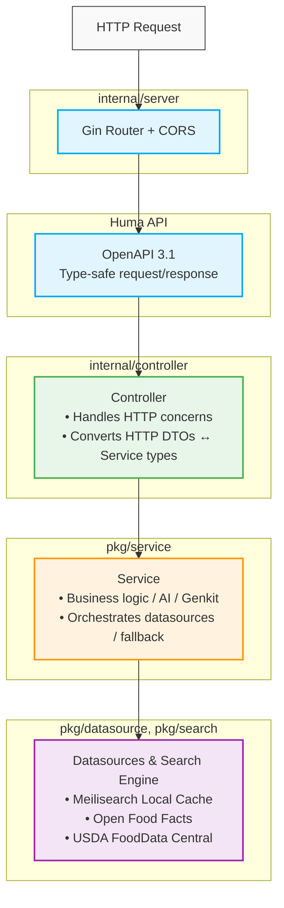

# VitalStack API Architecture

## Overview

The VitalStack API is a Go-based REST API following a **layered architecture** pattern. It uses Gin as the HTTP router, Huma for type-safe OpenAPI generation, and is designed for future Genkit AI integration.

## Directory Structure

```
apps/api-go/
├── main.go                    # Application entry point
├── cmd/                       # CLI commands (Cobra)
│   ├── root.go                # Root command, config loading, logging setup
│   └── server.go              # Server command with graceful shutdown
├── internal/                  # Private application code
│   ├── conf/                  # Configuration management
│   │   └── conf.go            # Viper flags and defaults
│   ├── controller/            # HTTP layer (handlers)
│   │   ├── nutrition_controller.go
│   │   └── nutrition_types.go # Request/Response DTOs
│   └── server/                # Server setup
│       └── server.go          # Gin + Huma + CORS configuration
├── pkg/                       # Public/shared packages
│   ├── datasource/            # External API clients (OFF, USDA)
│   ├── search/                # Local cache/search engines (Meilisearch)
│   ├── types/                 # Shared domain types
│   └── service/               # Business logic layer
│       ├── nutrition_service.go
│       └── product_service.go # Waterfall caching and product lookup
└── local-config.yaml          # Local development config
```

---

## Layered Architecture



---

## Key Components

### 1. Entry Point (`main.go`)

Minimal bootstrap that delegates to Cobra CLI:

```go
func main() {
    err := cmd.Execute()
    // ...
}
```

### 2. CLI Layer (`cmd/`)

| File | Purpose |
|------|---------|
| `root.go` | Cobra root command, Viper config loading, slog logger setup |
| `server.go` | Server startup, Genkit init, graceful shutdown with OS signals |

**Configuration Priority:** CLI flags → Environment variables → Config file

### 3. Server (`internal/server/`)

- **Gin Router** with recovery middleware
- **CORS** configured for SvelteKit dev server (`localhost:5173`)
- **Huma API** wrapper for OpenAPI 3.1 spec generation
- **Controller interface** for pluggable handlers

```go
type Controller interface {
    Register(api huma.API)
}
```

### 4. Controller (`internal/controller/`)

HTTP-layer concerns:
- Huma operation registration with OpenAPI metadata
- Request validation via Huma struct tags
- DTO conversion between HTTP and service layers

**Why separate types?**  
HTTP DTOs include `doc`, `example` tags for OpenAPI. Service types are clean domain objects.

### 5. Service (`pkg/service/`)

Business logic layer:
- **Nutrition Service:** Handles AI flows and macro estimations.
- **Product Service:** Implements a multi-layer waterfall architecture:
  1. **Cache:** Local Meilisearch index (fast, typo-tolerant).
  2. **Primary:** Open Food Facts HTTP API.
  3. **Secondary:** USDA FoodData Central HTTP API.

Located in `pkg/` because it may be shared across multiple commands or exposed as a library.

### 6. Datasource & Search (`pkg/datasource/`, `pkg/search/`)

Infrastructure integrations logic:
- Standardized `FoodDatasource` interface.
- Meilisearch integration for product snapshot caching.
- Option pattern implementations for configuring HTTP clients cleanly.

---

## API Endpoints

| Method | Path | Description |
|--------|------|-------------|
| `GET` | `/api/health` | Health check |
| `POST` | `/api/nutrition/scan` | Scan food image for macros |
| `GET` | `/api/products/search` | Full-text product search (waterfall) |
| `GET` | `/api/products/barcode/{ean}` | Lookup product by barcode |
| `GET` | `/docs` | OpenAPI documentation UI |
| `GET` | `/openapi.json` | OpenAPI 3.1 spec |

---

## Configuration

Configuration via Viper with support for:
- **CLI flags:** `--server.addr`, `--logging.level`
- **Environment:** `SERVER_ADDR`, `LOGGING_LEVEL`
- **Config file:** `--config local-config.yaml`

| Flag | Default | Description |
|------|---------|-------------|
| `server.addr` | `localhost:8080` | Server bind address |
| `logging.level` | `info` | Log level (debug/info/warn/error) |
| `logging.encoding` | `json` | Log format (json/logfmt) |

---

## Future: Genkit AI Integration

The Genkit instance is initialized in `cmd/server.go`:

```go
g := genkit.Init(ctx)
_ = g // Ready for AI flows
```

**Planned integration points:**
1. Add LLM plugin (Gemini/OpenAI) to Genkit init
2. Create AI flow in `pkg/service/` for food analysis
3. Call flow from `NutritionService.ScanFood()`

---

## Running the Server

```bash
# Development with hot reload
make dev-api

# With custom config
go run . --config local-config.yaml

# With flags
go run . --server.addr :9000 --logging.level debug
```
