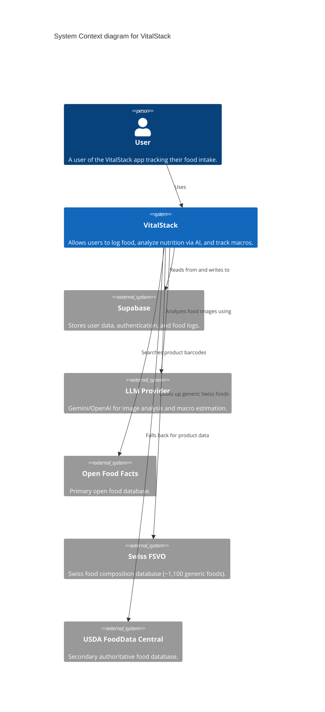
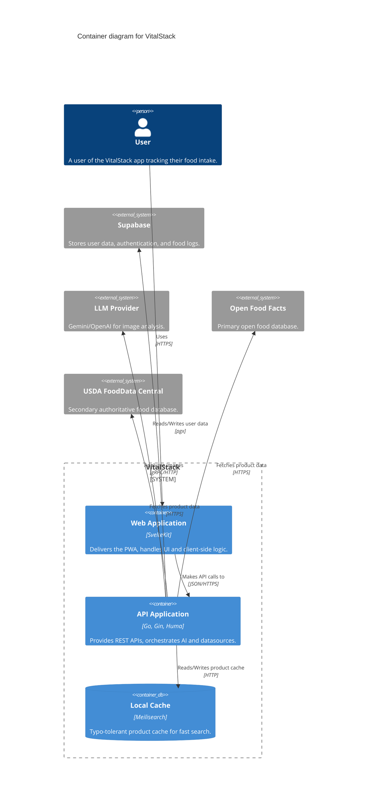
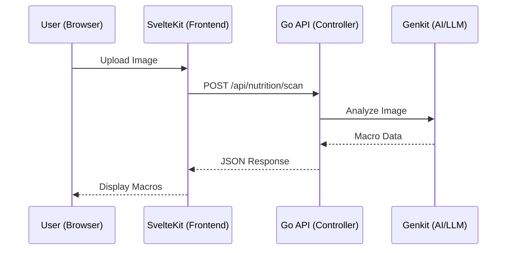
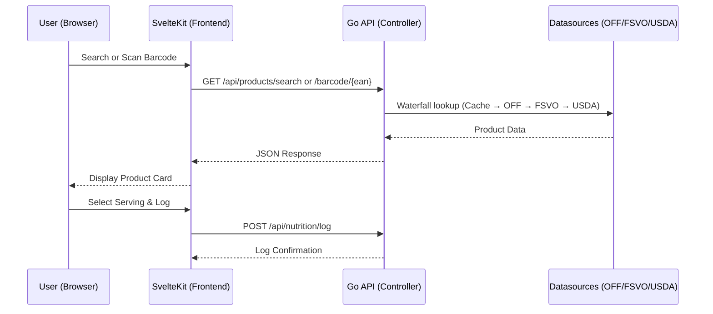

# VitalStack Architecture

This document provides a high-level overview of the VitalStack system architecture.

## System Overview

VitalStack is a **monorepo** containing a Go backend API and a SvelteKit frontend, designed to analyze food images and return nutritional macro information using AI.



### Container Level Overview



---

## Application Architecture

### Frontend (`apps/web`)

| Layer | Technology | Purpose |
|-------|------------|---------|
| Framework | SvelteKit | Routing, SSR, file-based routing |
| UI | Svelte 5 | Reactive components with Runes |
| Styling | TailwindCSS v4 + Shadcn-svelte | Utility CSS + component library |
| Theme | NutriFresh | Custom emerald/orange/cyan palette |
| PWA | Service Worker | Offline support, installable app |

📄 **Detailed docs:** [apps/web/architecture.md](apps/web/architecture.md)

---

### Backend (`apps/api-go`)

| Layer | Technology | Purpose |
|-------|------------|---------|
| CLI | Cobra + Viper | Commands, config, flags |
| HTTP | Gin + Huma v2 | Router, OpenAPI 3.1 generation |
| Controller | Huma handlers | Request validation, DTO conversion |
| Service | Business logic | AI/Genkit integration (future) |
| AI | Genkit | LLM orchestration (Gemini/OpenAI) |

📄 **Detailed docs:** [apps/api-go/architecture.md](apps/api-go/architecture.md)

---

## Request Flows

### AI Food Scan



### Product Search & Barcode Scan



---

## API Endpoints

| Method | Endpoint | Description |
|--------|----------|-------------|
| `GET` | `/api/health` | Health check |
| `POST` | `/api/nutrition/scan` | Analyze food image |
| `POST` | `/api/nutrition/log` | Log a food entry (AI or product-based) |
| `GET` | `/api/products/search` | Full-text product search (waterfall) |
| `GET` | `/api/products/barcode/{ean}` | Lookup product by barcode |
| `GET` | `/docs` | OpenAPI documentation |
| `GET` | `/openapi.json` | OpenAPI 3.1 spec |

---

## Development Setup

```bash
# Start both frontend and backend
make dev

# Start individually
make dev-web   # Frontend on :5173
make dev-api   # Backend on :8080
```

---

## Project Structure

```
VitalStack/
├── apps/
│   ├── api-go/              # Go backend
│   │   ├── architecture.md  # Backend architecture docs
│   │   ├── cmd/             # CLI commands
│   │   ├── internal/        # Private packages
│   │   └── pkg/             # Public packages
│   └── web/                 # SvelteKit frontend
│       ├── architecture.md  # Frontend architecture docs
│       ├── src/             # Source code
│       └── static/          # Static assets
├── Makefile                 # Dev orchestration
└── README.md                # This file links here
```
